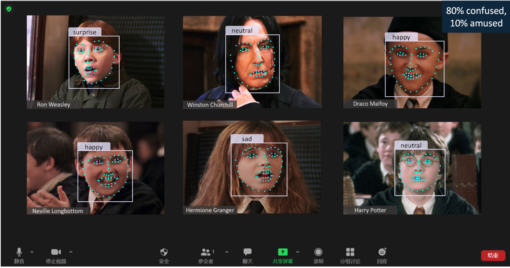
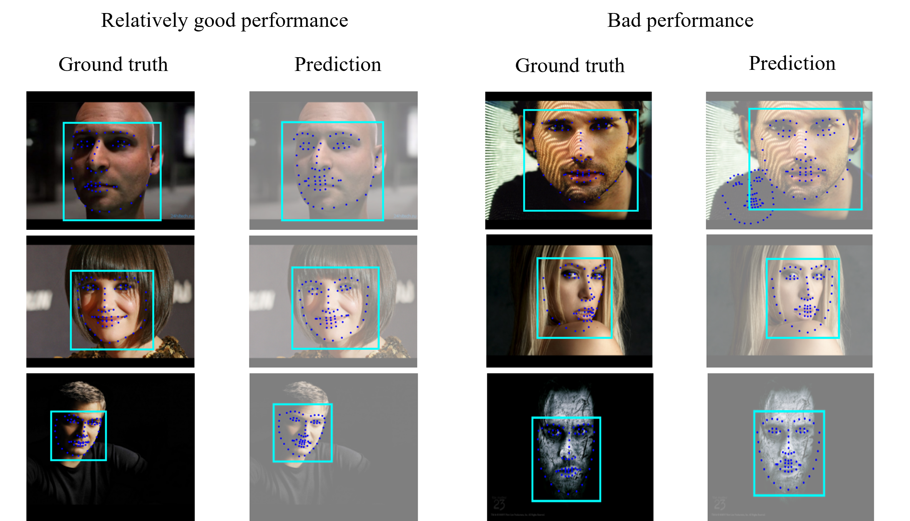

# facial-expression-recognition

## The ideal zoom system

## Demo

## Results
Model| Test accuracy
|:----:|:----------:|
MobileNet V2 | 55.1%
ResNet50 | 63.5%
Inception V3 | 68.0%
MLP | 60.0%
Ensemble  |  71.7% for 7 classes   82.9% for 3 classes

positive: “happy”, “surprised” 
negative: “anger”, “fear”, “sad” and “disgust” 
neutral: “neutral”
